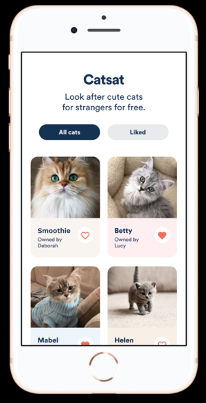

# Picnic React Native dev challenge



The aim of this project is to test your ability to develop two screens in an existing React Native app, following a design spec as precisely as possible.

We have aimed to make the tech stack as close as possible to the "real deal" you will be working with: the client is a React Native project using [Expo](https://expo.io/), and the server is a Node.js-based GraphQL server built with [`graphql-yoga`](https://www.npmjs.com/package/graphql-yoga), which is a thin layer on top of [express](https://expressjs.com/) and [Apollo Server](https://www.apollographql.com/docs/apollo-server/). The whole project is written in TypeScript, with types generated from the GraphQL schema using [`graphql-codegen`](https://graphql-code-generator.com/). All of these things are already set up for you, you just need to implement the layouts of the screens in the design spec.

## Step 1: The design spec

[**Check out the design spec here.**](https://www.figma.com/file/Y0N6jk9SYSwveaci5oUjo3/Picnic-Tech-Task)

We are using [Figma](https://www.figma.com/) as our main design tool. You will have to create an account to use the tool.

Once logged in, you will be able to click on any shape in the layouts, and see CSS rules like the font family, font size, etc.

Note that the layout rules (like `position`, `width`, `height`, etc.) mentioned in the sidebar very rarely match up to the CSS that is actually needed in the app. Rather than exact widths/heights, you should mostly be focusing on making the margins/paddings match the spec closely, as well as font sizes and colors.

A very useful tool for finding out margins in Figma is to select a shape, hold down the `alt` button, and hover over any other shape. You will then see the distance between the shapes show up.

Make sure you're happy with navigating the Figma project before getting started! If anything is unclear, please ask!

## Step 2: Setting up your dev environment

To get started, fork this repository on GitHub by clicking the "Fork" button in the top-right corner. **Please make sure your forked repo is private.** (It should be private by default.)

Once you have forked the repo, please add me ([**@lachenmayer**](https://github.com/lachenmayer)) as a collaborator to your repo, so I can check out your code once you're finished.

### Folder structure

The repo contains two JS packages, `client` and `server`. I recommend having (at least) two terminal windows/tabs open, so that you can have the server and client build tools running at all times.

### The server

To set up the server, open a terminal, and `cd` to the `server` directory. Once in the server directory, run the following

```
npm install
```

Once the installation is complete, you can run the following command to run a dev server:

```
npm run dev
```

This will start a server which will restart any time you make changes in the `server` directory. **You should not have to make any changes to the server code**, but you if you want to try out making some changes, feel free. (Of course I can't guarantee that the server is bug-free, so maybe you might have to make changes after all...!)

If everything went smoothly, you should see:

```
Server is running on http://localhost:4000
```

If you visit [`http://localhost:4000`](http://localhost:4000) in your browser, you should see the "GraphQL Playground", where you can experiment with making queries.

You can click on the "DOCS" tab on the right hand side of the screen to see what fields are available to you.

To get started, try entering this query in the left hand side of the screen:

```graphql
query Cats {
  cats {
    id
    name
  }
}
```

If you press the play button, you should see some results on the right side of the screen.

### The client

If you're setting up Expo for the first time, this might take a little bit more time -- hopefully this will work smoothly but **if you have any issues getting Expo running, please reach out to me, and I can help sort it out**.

There are two options for developing the client:

1. Download the Expo app on your phone, and develop on your phone. Simply get the app from [Android Play Store](https://play.google.com/store/apps/details?id=host.exp.exponent) / [iOS App Store](https://itunes.com/apps/exponent).
2. Use the iOS Simulator on your laptop if you have a Mac. [Follow this guide](https://docs.expo.io/versions/v34.0.0/workflow/ios-simulator/) to set that up.

In a separate terminal window/tab from the one running your server, `cd` to the `client` directory.

Then run:

```
npm install
```

Once everything is installed, try running:

```
npm run start
```

This will run the Expo CLI tool.

If everything works smoothly, a browser window should open. Expo will probably ask you to sign up / log in the first time you use it.

If you open up the Expo app, you should see the "Catsat" show up in the "Recently in Development" list. (If you are using the iOS simulator instead, click on "open iOS simulator" in the browser window, or press `i` in the command line tool.)

You can start the app by tapping on it in the list. (Make sure your server is running before you start the app!)

### GraphQL types

In a separate terminal window/tab, `cd` to the `client` directory, and run:

```
npm run types:watch
```

This runs the GraphQL code generator, and will update the TypeScript definitions whenever you change any of the GraphQL queries. You will need this running if you are specifying new queries, or adding new fields to existing queries, otherwise the changes to your queries will not show up in the client code.

### Setting up your editor

I recommend using either [VS Code](https://code.visualstudio.com/), or [Atom](https://atom.io/) if you prefer.

VS Code comes with TypeScript support out of the box, so you should be able to just open any of the TypeScript files without problems.

If you're using Atom, I strongly recommend installing the [`atom-ide-ui` and `ide-typescript` packages](https://ide.atom.io/). This will make your life much easier, as errors will show up in your editor, component names will auto-complete, etc.

**Please definitely install [**ESLint**](https://eslint.org/docs/user-guide/integrations#editors) and [**Prettier**](https://prettier.io/docs/en/editors.html) plugins in your editor.** We use these tools to maintain a consistent code style. The Prettier plugin will automatically format your code to a consistent style whenever you save any TypeScript or JavaScript file -- if that does not happen automatically, make sure you enable the "Format on Save" option in your editor.

## Helpful links

- [Expo docs](https://docs.expo.io/versions/latest/)
- [Introduction to GraphQL](https://graphql.org/learn/)
- [TypeScript Deep Dive](https://basarat.gitbooks.io/typescript/content/)